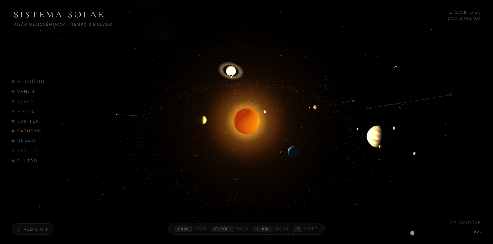

<div align="center">
  
</div>

<br/>

<div align="center">

# 🪐 SISTEMA SOLAR

**Visualização 3D interativa do sistema solar — construída com Three.js**

[](https://developer.mozilla.org/en-US/docs/Web/HTML)
&nbsp;
[](https://developer.mozilla.org/en-US/docs/Web/CSS)
&nbsp;
[](https://developer.mozilla.org/en-US/docs/Web/JavaScript)
&nbsp;
[](https://threejs.org/)
&nbsp;
[](https://phkaiba.github.io/system_solar/system_solar.html)

[**▶ Acessar o Projeto ao Vivo**](https://phkaiba.github.io/system_solar/system_solar.html) · [Reportar Bug](https://github.com/PHKaiba/system_solar/issues) · [Sugerir Melhoria](https://github.com/PHKaiba/system_solar/issues)

</div>

---

## Sobre o Projeto

O **Sistema Solar 3D** é uma simulação interativa renderizada em tempo real com WebGL via Three.js. Cada planeta orbita o Sol com períodos proporcionais reais, conta com dados astronômicos precisos e pode ser explorado individualmente — tudo diretamente no navegador, sem instalação.

> *"Visão heliocêntrica · Tempo simulado · 9 planetas + Plutão"*

---

## Funcionalidades

- 🪐 &nbsp; **9 planetas + Plutão** com órbitas animadas em tempo real
- 🔭 &nbsp; **Dados astronômicos detalhados** — clique em qualquer planeta para ver diâmetro, distância, período orbital, luas, temperatura e gravidade
- 🌌 &nbsp; **Campo de estrelas procedural** como plano de fundo imersivo
- ☄️ &nbsp; **Cometas e cinturão de asteroides** animados
- 🎛️ &nbsp; **Controle de velocidade** da simulação
- 🎵 &nbsp; **Trilha sonora ambiente** para imersão total
- 🖱️ &nbsp; **Navegação completa** — arrastar, girar, zoom e focar em planetas

---

## Controles

| Ação | Controle |
|------|----------|
| Rotacionar câmera | `Arrastar` |
| Zoom | `Scroll do mouse` |
| Focar em um planeta | `Clique` |
| Resetar câmera | `R` |
| Navegar pelos planetas | `Lista lateral` |

---

## Tecnologias

| Tecnologia | Função |
|---|---|
| **HTML5** | Estrutura e marcação semântica |
| **CSS3** | Estilização e layout da interface |
| **JavaScript** | Lógica, interatividade e animações |
| **Three.js** | Renderização 3D via WebGL |

---

## Como Rodar Localmente

```bash
# 1. Clone o repositório
git clone https://github.com/PHKaiba/system_solar.git

# 2. Entre na pasta
cd system_solar

# 3. Abra no navegador via Live Server (recomendado no VS Code)
```

> Nenhuma dependência externa necessária além do navegador. Para melhor experiência, use a extensão **Live Server** no VS Code.

---

## Estrutura do Projeto

```
system_solar/
├── system_solar.html       # Página principal
├── style.css               # Estilos globais
├── main.js                 # Lógica Three.js e simulação
└── assets/
    ├── print1.jpeg         # Preview do projeto
    └── ...
```

---

## Demo

Acesse a simulação em produção:

**[phkaiba.github.io/system_solar](https://phkaiba.github.io/system_solar/system_solar.html)**

---

## Autor

**Pedro Henrique** — São Paulo, BR

[](https://github.com/PHKaiba)
&nbsp;
[](https://www.linkedin.com/in/pedro-henrique-zonzini-57a940320/)
&nbsp;
[](https://www.instagram.com/dortazssw/)

---

<div align="center">
  <sub>Desenvolvido com 🚀 por Pedro Henrique &nbsp;·&nbsp; São Paulo, BR</sub>
</div>
